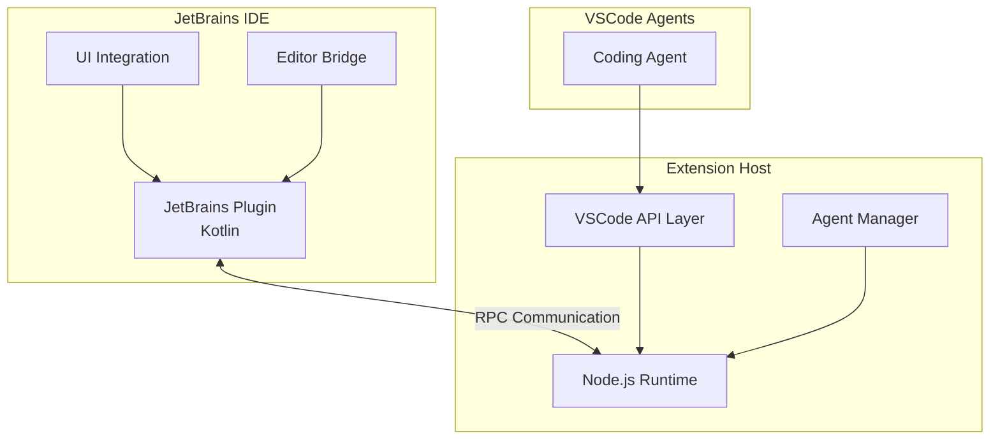

# Roo Code for JetBrains (Community Edition)

English | [简体中文](README_zh.md)

[](https://opensource.org/licenses/Apache-2.0)
[](https://nodejs.org/)
[](https://www.jetbrains.com/)

> **Bring the power of Roo Code (Cline) to JetBrains IDEs. A community-driven effort to provide a stable, feature-rich experience where official support is missing.**

Roo Code for JetBrains (Community Edition) allows you to run the full [Roo Code](https://roocode.com) AI assistant within the JetBrains ecosystem. It solves the problem of Roo Code lacking an official, stable plugin for JetBrains IDEs by providing a deeply optimized environment to run the VSCode-based agent.

### 💡 Why this version?
While an official branding fork exists, it inherits many unresolved issues from the original RunVSAgent project, making it difficult to use in daily production. This community edition (**abcxlab**) is dedicated to fixing those gaps:

*   **Truly Usable**: Fixed critical JCEF timing bugs, editor concurrency deadlocks, and UI freezes that often plague the official version.
*   **Feature Parity**: Integrated support for Checkpoints, Problem Selectors, and full Keymap/i18n—ensuring the JetBrains experience matches the VSCode original.
*   **Production Ready**: Optimized for professional use across all JetBrains IDEs, including first-class support for PyCharm.

## 📸 Screenshot


## 🚀 Core Features

- **VSCode Agent Compatibility**: Seamlessly run VSCode-based coding agents in JetBrains IDEs
- **Cross-IDE Development**: Unified agent experience across different IDE platforms

## 🔧 Supported IDEs

### Jetbrains IDEs
Roo Code for JetBrains currently supports the following JetBrains IDE series:

- **IntelliJ IDEA** (Ultimate & Community)
- **WebStorm** - JavaScript and TypeScript development
- **PyCharm** (Professional & Community) - Python development
- **PhpStorm** - PHP development
- **RubyMine** - Ruby development
- **CLion** - C/C++ development
- **GoLand** - Go development
- **DataGrip** - Database development
- **Rider** - .NET development
- **Android Studio** - Android development

> **Note**: Requires JetBrains IDE version 2023.1 or later for optimal compatibility.

### XCode IDE
Working on it...

## 🤖 Supported Agents

- **[Roo Code](https://roocode.com)**: Advanced AI-powered coding assistant with intelligent code generation and refactoring capabilities

## 🏗️ Architecture



**Architecture Components**:
- **JetBrains Plugin**: Kotlin-based IDE plugin for JetBrains IDE integration
- **Extension Host**: Node.js runtime environment providing VSCode API compatibility layer
- **RPC Communication**: High-performance inter-process communication for real-time data exchange
- **VSCode Agents**: Various coding agents and extensions developed for the VSCode platform

## 📦 Installation

### [Download from JetBrains Marketplace](https://plugins.jetbrains.com/plugin/28068-runvsagent) (Recommended)

**Recommended Method**: We recommend downloading and installing the plugin from JetBrains Marketplace first, as this is the most convenient and secure installation method.

1. **Online Installation**:
   - Open your JetBrains IDE (IntelliJ IDEA, WebStorm, PyCharm, etc.)
   - Go to `Settings/Preferences` → `Plugins`
   - Search for "Roo Code for JetBrains" in the `Marketplace` tab
   - Click the `Install` button
   - Restart your IDE when prompted
 
2. **Verify Installation**: After restart, you should see the Roo Code for JetBrains plugin in your IDE's plugin list

### Download from GitHub Releases

You can download the pre-built plugin from our GitHub releases page:

1. **Download Plugin**: Visit the [GitHub Releases](https://github.com/abcxlab/Roo-Code-JetBrains/releases) page and download the latest plugin file (`.zip` format)

2. **Install in JetBrains IDE**:
   - Open your JetBrains IDE (IntelliJ IDEA, WebStorm, PyCharm, etc.)
   - Go to `Settings/Preferences` → `Plugins`
   - Click the gear icon ⚙️ and select `Install Plugin from Disk...`
   - Select the downloaded `.zip` file
   - Restart your IDE when prompted

3. **Verify Installation**: After restart, you should see the Roo Code for JetBrains plugin in your IDE's plugin list


### Build from Source

#### Prerequisites
- Node.js 18.0+
- JetBrains IDE 2023.1+
- Git
- JDK 17+

#### Build Steps

```bash
# 1. Clone the repository
git clone https://github.com/abcxlab/Roo-Code-JetBrains.git
cd Roo-Code-JetBrains

# 2. Setup development environment
./scripts/setup.sh

# 3. Build the project
./scripts/build.sh

# 4. Install plugin
# Plugin file located at: jetbrains_plugin/build/distributions/
# In IDE: Settings → Plugins → Install Plugin from Disk
```

#### Development Mode

```bash
# Start extension host in development mode
cd extension_host
npm install
npm run dev

# Run JetBrains plugin in development mode
cd jetbrains_plugin
./gradlew runIde
```

## 👥 Developer Information

### Project Structure

```
Roo-Code-JetBrains/
├── extension_host/          # Node.js Extension Host
│   ├── src/                # TypeScript source code
│   │   ├── main.ts         # Main entry point
│   │   ├── extensionManager.ts  # Extension lifecycle management
│   │   ├── rpcManager.ts   # RPC communication layer
│   │   └── webViewManager.ts    # WebView support
│   └── package.json        # Node.js dependencies
├── jetbrains_plugin/       # JetBrains Plugin
│   ├── src/main/kotlin/    # Kotlin source code
│   │   └── com/roocode/jetbrains/
│   │       ├── core/       # Core plugin functionality
│   │       ├── actions/    # IDE actions and commands
│   │       ├── editor/     # Editor integration
│   │       └── webview/    # WebView support
│   └── build.gradle.kts    # Gradle build configuration
└── scripts/                # Build and utility scripts
```

### Technology Stack

- **Extension Host**: Node.js 18+, TypeScript 5.0+
- **JetBrains Plugin**: Kotlin 1.8+, IntelliJ Platform 2023.1+
- **Communication**: RPC over Unix Domain Sockets/Named Pipes
- **Build Tools**: npm/pnpm, Gradle, Shell scripts

### Known Issues

For a list of known issues and common problems, please see [Known Issues](docs/KNOWN_ISSUES.md).

### Contributing

1. Fork the repository
2. Create a feature branch: `git checkout -b feature/your-feature`
3. Make your changes and add tests
4. Run tests: `./scripts/test.sh`
5. Submit a pull request

## 👥 Contributors

We thank all the contributors who have helped make this project better:

### 🌟 Core Contributors
- **[Naituw](https://github.com/Naituw)** - *Project Architect*
- [wayu002](https://github.com/wayu002)
- [joker535](https://github.com/joker535)
- [andrewzq777](https://github.com/andrewzq777)
- [debugmm](https://github.com/debugmm)
- [Micro66](https://github.com/Micro66)
- [qdaxb](https://github.com/qdaxb)

### 🚀 Contributors

- [junbaor](https://github.com/junbaor)

### License

This project is licensed under the Apache License 2.0. See [LICENSE](LICENSE) for details.

### Maintainers

- **Organization**: abcxlab Team
- **Contact**: [GitHub Issues](https://github.com/abcxlab/Roo-Code-JetBrains/issues)

---

## Star History

[](https://www.star-history.com/#abcxlab/Roo-Code-JetBrains&Date)
**Made with ❤️ by abcxlab Team**
