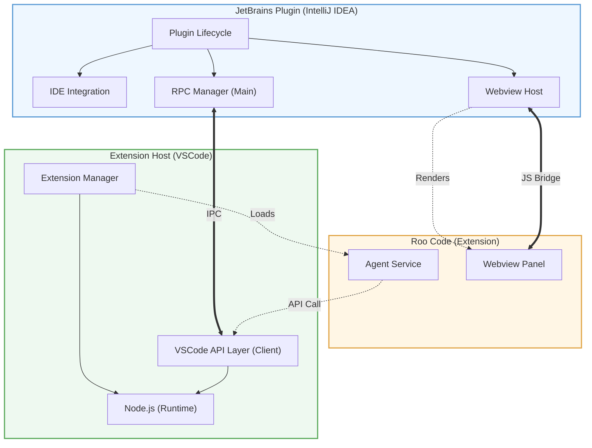
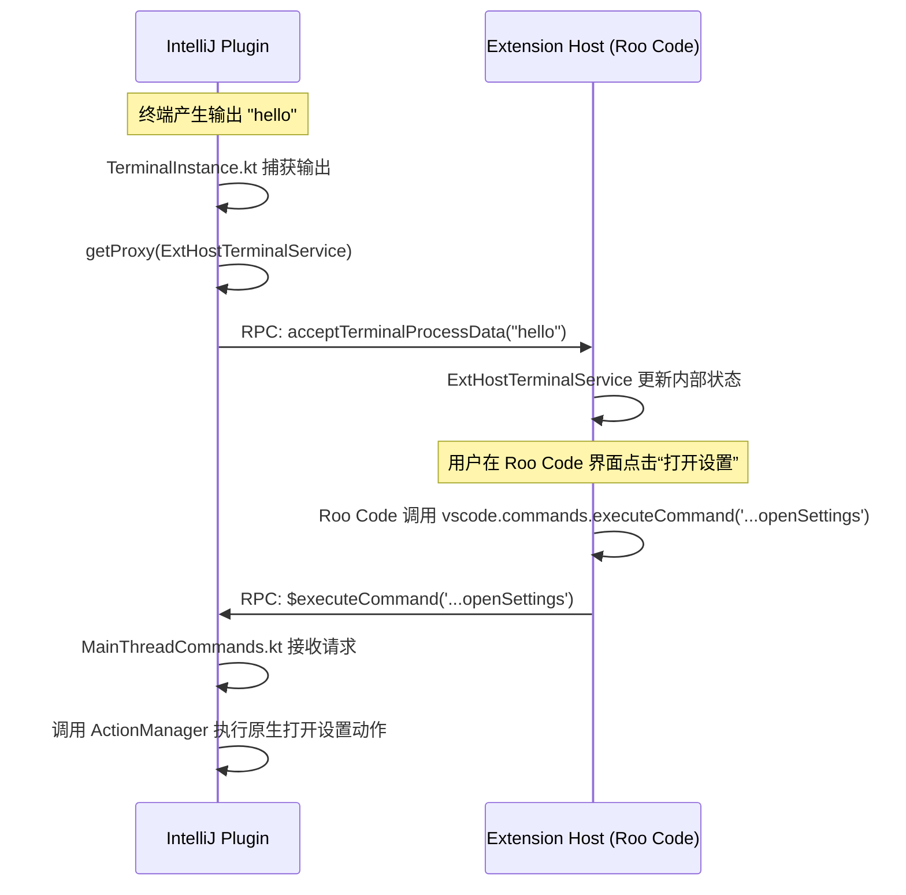
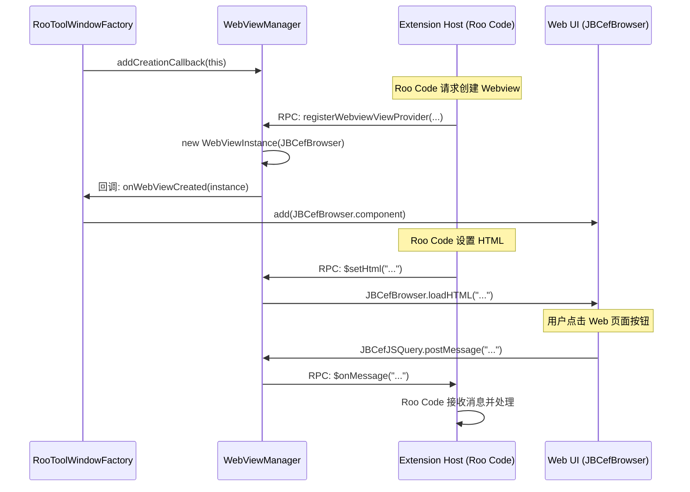
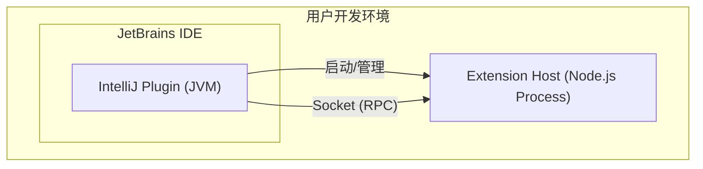

# 架构设计文档：Roo Code for JetBrains

> **使用说明**: 本模板用于编写软件项目架构设计文档。模板提供了架构设计的标准结构和关键要素，帮助开发团队理解系统的整体架构、组件关系及技术选型。

---

## 📌 文档信息

| 项目 | 描述 |
|------|------|
| 项目名称 | Roo Code for JetBrains |
| 文档版本 | v1.1.0 |
| 作者 | Roo Code Team |
| 审核人 | - |
| 创建日期 | 2025-08-15 |
| 最后更新 | 2026-03-16 |
| 状态 | 已发布 |

## 📝 修订历史

| 版本 | 日期 | 描述 | 作者 |
|------|------|------|------|
| 0.1 | 2025-08-15 | 初稿，完成架构目标、整体架构概述和附录术语表 | AI Assistant |
| 1.1 | 2026-03-16 | 品牌重塑为 Roo Code for JetBrains，更新包名和通信逻辑 | Roo Code Team |

## 🎯 1. 架构设计目标

### 1.1 设计目的

本文档旨在详尽阐述 Roo Code for JetBrains 项目的系统架构。其核心目的是为现有及未来的开发与维护人员提供一份清晰、准确的指导蓝图，确保团队对项目的核心设计原则、组件职责、关键流程及技术决策有深入且一致的理解。

本文档的核心内容围绕 **“模拟与适配（Simulation & Adaptation）”** 这一核心架构思想展开，详细说明系统如何通过该架构，实现让一个为 VSCode 生态编写的、基于 TypeScript 的插件（如 Roo Code），能够无缝地运行在完全不同的 JetBrains IDE 环境（Kotlin/JVM）中。

### 1.2 系统目标

本项目的核心业务目标是**打破主流 IDE 生态壁垒**，允许一个独立的、基于 Web 技术的 VSCode 插件（以 Roo Code 为代表）与一个功能强大的原生 JVM 桌面应用（以 IntelliJ IDEA 为代表）进行深度、双向的功能集成。

具体实现以下系统级目标：
- **插件可移植性**: 使 VSCode 插件只需面向标准的 `VS Code.*` API 开发，无需关心底层宿主是真实的 VSCode 还是被模拟的 JetBrains IDE。
- **功能对等性**: 在 JetBrains IDE 中，为 VSCode 插件提供与原生 VSCode 环境高度一致的功能支持，包括但不限于：UI 渲染（WebView）、命令执行、终端交互、文件系统访问等。
- **双向通信**: 建立一个高效、稳定的双向通信渠道，确保 JetBrains 插件的状态能够实时同步给 VSCode 插件，反之亦然。
- **原生体验**: 将 VSCode 插件的功能（尤其是 UI）无缝嵌入到 JetBrains IDE 的原生组件中，为用户提供统一、流畅的操作体验。

### 1.3 设计约束

- **技术平台异构**: 必须解决 JVM (Kotlin, IntelliJ Platform) 与 Node.js (TypeScript, VSCode API) 两个完全不同的技术栈之间的互操作性问题。
- **依赖 IntelliJ Platform**: 所有原生 UI 和核心 IDE 功能的实现，必须依赖 JetBrains 提供的平台 API。
- **兼容 VSCode API**: 必须提供一个与 VSCode Extension API 高度兼容的运行环境，以最小化 VSCode 插件的迁移成本。
- **Node.js 环境**: 用户的系统环境中必须预装指定版本范围的 Node.js，作为 `extension_host` 进程的运行时。
- **跨平台运行**: 必须支持主流桌面操作系统（Windows, macOS, Linux），并 handle 好各平台间的差异（如 Socket 类型、文件路径等）。

### 1.4 质量属性

| 质量属性 | 要求描述 | 优先级 |
|----------|----------|--------|
| **可扩展性** | 架构应易于扩展，以支持未来适配更多 VSCode API 和集成到其他 JetBrains IDE 中。RPC 接口的设计应清晰、稳定。 | 高 |
| **可维护性** | 通过清晰的责任划分（主从进程、原生UI/Web内容分离），以及面向接口的编程（RPC Shape/Proxy），降低模块间耦合，提高代码的可读性和可维护性。 | 高 |
| **性能** | 进程间通信（RPC）的延迟应尽可能低，以保证交互的实时性。WebView 的加载和渲染速度应足够快，避免影响用户体验。 | 中 |
| **稳定性** | `extension_host` 作为一个独立的进程，其崩溃不应导致整个 IDE 崩溃。双方都应有健全的异常处理和进程管理机制。 | 高 |
| **安全性** | 进程间通信必须限制在本地（localhost），避免外部访问。对文件系统的操作应遵循 IDE 的权限模型。 | 中 |

## 🏗️ 2. 系统整体架构

### 2.1 架构概述

Roo Code for JetBrains 的核心架构是一种**模拟与适配（Simulation & Adaptation）**架构。此架构选择的根本目的是为了**最大化地复用现有 VSCode 生态和插件代码**，避免在 JetBrains 平台上完全重写功能强大的 VSCode 插件（如 Roo Code），同时将两个异构平台（JVM vs Node.js）的差异性完全隔离在 IntelliJ 插件这个“适配层”中。

系统由两个独立但紧密协作的进程组成：
1.  **IntelliJ 插件 (主/Master)**: 作为系统的控制中心，它运行在 IntelliJ IDE 的 JVM 中。它不仅负责提供所有与 IDE 交互的原生功能（如创建工具窗口、文件操作），还通过模拟 VSCode 的主进程（Main Thread）行为，响应来自 `extension_host` 的 RPC 请求。
2.  **Extension Host (从/Slave)**: 作为一个独立的 Node.js 进程，它加载了 VSCode 的核心库，创建了一个标准的、可托管 VSCode 插件的“沙箱”环境。它负责运行 Roo Code 插件的 TypeScript 代码，并通过 RPC 与 IntelliJ 插件进行双向通信。

这种主从结构和关注点分离的设计，使得 Roo Code 插件可以保持平台无关性，只依赖标准的 VSCode API 进行开发，而所有与 IntelliJ 平台相关的适配工作都集中在 IntelliJ 插件这一侧完成。

### 2.2 架构图

**要点说明:**

1.  **JetBrains Plugin (IntelliJ IDEA)**: 作为主进程，负责 IDE 集成和作为 Agent 的宿主。
    *   `Plugin Lifecycle`: 由 `plugin.xml` 声明的入口（如 `projectService`），负责初始化和管理插件所有核心组件。
    *   `IDE Integration`: 与编辑器、文件系统等原生功能的桥接。
    *   `RPC Manager (Main)`: **作为 IPC 服务端，启动 Socket 监听，并管理所有 `MainThread` API 的实现**。
    *   `Webview Host`: **由插件提供的原生组件 (基于 JBCefBrowser)，作为 `Webview Panel` 的宿主容器**。
2.  **Extension Host (VSCode)**: 扩展进程，为 Agent 提供标准的 VSCode 运行时。
    *   `Node.js (Runtime)`: 进程的基础环境。
    *   `VSCode API Layer (Client)`: **作为 IPC 客户端，连接到 `RPC Manager (Main)`，并提供标准的 VSCode API 接口**。
    *   `Extension Manager`: 负责加载和管理 `Roo Code Agent`。
3.  **Roo Code (Extension)**: 运行在 `Extension Host` 中的标准扩展。
    *   `Agent Service`: Agent 的核心业务逻辑，负责调用 `VSCode API Layer`。
    *   `Webview Panel`: **由 Agent 定义的 UI 内容 (HTML/CSS/JS)，被渲染在 `Webview Host` 中**。
4.  **核心交互**:
    *   **IPC**: `RPC Manager (Main)` 与 `VSCode API Layer (Client)` 之间通过 Socket 进行双向 IPC 通信。
    *   **API Call**: `Agent Service` 通过 `VSCode API Layer` 执行标准 VSCode 操作。
    *   **Renders / JS Bridge**: `Webview Host` 渲染 `Webview Panel` 的内容，并通过 `JS Bridge` 实现**双向通信**。

### 2.3 架构风格与模式

- **主从模式 (Master-Slave)**: IntelliJ 插件作为主控端，全权负责 `extension_host` 进程的启动、管理和销毁。
- **客户端-服务器模式 (Client-Server)**: 在正常运行模式下，IntelliJ 插件作为 TCP/UDS 服务器，`extension_host` 作为客户端连接，建立了稳定的通信基础。
- **发布-订阅模式 (Publish-Subscribe)**: 在 UI 创建流程中，通过回调机制实现了解耦。`RooToolWindowFactory` (订阅者) 向 `WebViewManager` (发布者) 订阅 WebView 创建事件。
- **适配器模式 (Adapter)**: IntelliJ 插件中的 `MainThread...Shape` 实现类是典型的适配器，它们将 VSCode RPC 协议的接口适配到 IntelliJ 平台具体的 API 调用上。

### 2.4 技术栈选型

| 层级/组件 | 技术/框架 | 版本 | 选型理由 |
|------|-----------|------|----------|
| **IntelliJ 插件** | Kotlin | 1.8+ | JetBrains 官方推荐语言，与 Java 无缝互操作，语法现代简洁。 |
| | IntelliJ Platform SDK | 2023.3+ | 提供与 JetBrains IDE 深度集成的所有基础 API。 |
| **扩展宿主** | Node.js | 18+ | VSCode 扩展的标准运行时，提供必要的 JavaScript 运行环境。 |
| | TypeScript | 5.0+ | 为 JavaScript 提供静态类型检查，是 VSCode 插件开发的首选语言，提高代码质量和可维护性。 |
| **UI 渲染** | JCEF (Java Chromium Embedded Framework) | - | JetBrains 平台内置的嵌入式浏览器，用于渲染 Roo Code 插件提供的 Web UI，是实现混合 UI 的关键。 |
| | HTML/CSS/JS (React/Vue等) | - | Roo Code 插件的前端技术栈，利用 Web 技术的灵活性和丰富的生态来构建复杂的用户界面。 |
| **进程间通信** | VSCode `IRPCProtocol` | - | 完全复用 VSCode 成熟、稳定、高效的 RPC 机制，避免重复造轮子，并保证了与 VSCode API 的兼容性。 |
| **构建系统** | Gradle | - | IntelliJ 插件开发标准的构建工具。 |
| | PNPM / TSUP | - | `extension_host` 端使用的包管理和打包工具，高效且符合现代前端工程化标准。 |

## 🧩 3. 系统分层设计

本项目在宏观上可以看作一个典型的三层架构：**表现层 (Presentation Layer)**、**应用层 (Application Layer)** 和 **适配层 (Adaptation Layer)**。

### 3.1 表现层

- **职责**: 负责所有用户可见的 UI 元素的渲染和基本交互。
- **构成**:
    - **原生 UI (IntelliJ Plugin)**: 包括由 `plugin.xml` 和 `RooToolWindowFactory` 创建的 `ToolWindow` 框架、标题栏、工具栏按钮等。这部分使用 IntelliJ 的原生 Swing 组件。
    - **Web UI (Roo Code Plugin)**: 由 Roo Code 插件提供的、运行在 `JBCefBrowser` 中的 Web应用。它负责聊天界面、输入框等所有核心交互内容的渲染。
- **交互**: 原生 UI 和 Web UI 通过 `WebViewManager` 建立的 JS Bridge 进行通信。

### 3.2 应用层

- **职责**: 负责实现核心的业务逻辑。
- **构成**:
    - **Roo Code 插件 (extension_host)**: 作为核心应用，它包含了所有的 AI 辅助编程逻辑、任务管理、与大模型交互等功能。它完全基于标准的 `VS Code.*` API 开发。

### 3.3 适配层

- **职责**: 这是本架构的关键，负责连接表现层和应用层，并解决两个异构平台之间的差异。
- **构成**:
    - **IntelliJ 插件 (MainThread Simulation)**: 实现了所有 `MainThread...` RPC 接口，将来自 Roo Code 插件的 `VS Code.*` API 调用翻译成对 IntelliJ 平台 API 的调用。
    - **`VS Code` 核心库 (ExtHost Services)**: 实现了所有 `ExtHost...` RPC 接口，将来自 IntelliJ 插件的事件和状态更新通知给 Roo Code 插件。

## 🧩 4. 核心组件详细设计

### 4.1 组件一：IntelliJ 插件 (主进程模拟器)

#### 4.1.1 功能职责

作为系统的“主/Master”，IntelliJ 插件承担以下核心职责：
- **生命周期管理**: 负责启动、监控和终止 `extension_host` Node.js 进程。
- **主进程模拟**: 通过实现一系列 `MainThread...Shape` 接口，精确模拟 VSCode 的主进程行为，为 `extension_host` 提供其运行所需的 RPC 服务端。
- **原生 UI 容器提供**: 创建和管理 `ToolWindow` 和 `JBCefBrowser` 实例，为 Roo Code 插件的 Web UI 提供一个原生“外壳”。
- **平台能力适配**: 将 `extension_host` 请求的通用功能（如文件读写、命令执行）适配并委派给 IntelliJ 平台的原生 API 来执行。

#### 4.1.2 内部结构

- **启动与管理 (`WecoderPluginService`, `ExtensionProcessManager`)**:
    - `plugin.xml` 中注册的 `WecoderPluginService` 是插件的初始化入口。
    - 在其 `initialize` 方法中，它会创建一个 `ExtensionProcessManager` 实例，并调用其 `start()` 方法。
    - `ExtensionProcessManager` 负责构建 `node` 命令行，启动 `extension_host` 子进程，并管理其生命周期。
- **RPC 双向角色**:
    - **作为服务端**: `RPCManager` (Kotlin) 在与 `extension_host` 建立 Socket 连接后被创建。它负责实例化所有 `MainThread...Shape` 接口的实现类（如 `MainThreadCommands`），并通过 `rpcProtocol.set()` 方法将这些实例注册为 RPC 服务处理器，用于**响应**来自 `extension_host` 的调用。
    - **作为客户端**: 当需要主动通知或请求 `extension_host` 时（例如，同步终端输出），插件会通过 `rpcProtocol.getProxy()` 获取 `ExtHost...` 接口的动态代理，并发起 RPC **调用**。
- **WebView 管理 (`WebViewManager`, `RooToolWindowFactory`)**:
    - `WebViewManager` 是一个项目级服务，作为 WebView 的总管家。
    - 它通过异步回调机制与 `RooToolWindowFactory` 解耦，负责响应来自 `extension_host` 的 RPC 请求来创建 `JBCefBrowser` 实例，并通过 `JBCefJSQuery` 和 `executeJavaScript` 实现与 Web 页面的双向通信。

### 4.2 组件二：Extension Host (VSCode 插件沙箱)

#### 4.2.1 功能职责

作为系统的“从/Slave”，`extension_host` 承担以下核心职责：
- **提供标准 VSCode 环境**: 加载 `VS Code` 核心库，创建一个功能完备的沙箱环境，让标准的 VSCode 插件可以无缝运行。
- **托管 Roo Code 插件**: 负责加载并执行 Roo Code 插件的 TypeScript 代码，响应其 `activate` 事件。
- **RPC 双向角色**:
    - **作为客户端**: 当需要调用 JetBrains IDE 的原生能力时，它会通过 `rpcProtocol.getProxy()` 获取 `MainThread...` 接口的动态代理，并发起 RPC **调用**。
    - **作为服务端**: `VS Code` 核心库或我们的模拟代码会通过 `rpcProtocol.set()` 注册 `ExtHost...` 接口的实现，用于**响应**来自 `jetbrains_plugin` 的调用（例如，同步 IDE 状态变更）。
- **提供 Web UI 内容**: Roo Code 插件通过 `Webview` API 生成 UI 的 HTML/CSS/JS 内容，并通过 RPC 发送给 IntelliJ 插件进行渲染。

#### 4.2.2 内部结构

- **双重启动模式：生产 vs. 调试**:
    - **生产模式 (Production Mode)**:
        - **入口**: [`extension_host/src/extension.ts`](extension_host/src/extension.ts:1)。此脚本由 `jetbrains_plugin` 的 `ExtensionProcessManager` 启动。
        - **核心驱动**: `extension.ts` 的主要职责是建立与 `jetbrains_plugin` 的 Socket 连接，然后立即调用从 `VSCode` 核心库导入的 `start()` 函数，将控制权完全交给 [`deps/vscode/src/vs/workbench/api/node/extensionHostProcess.ts`](deps/vscode/src/vs/workbench/api/node/extensionHostProcess.ts:1)。
        - **RPC 服务实现**: 在此模式下，所有 `MainThread...` 和 `ExtHost...` 服务的 RPC 客户端代理和 RPC 服务端实现，均由 `extensionHostProcess.ts` 及其依赖的 `VSCode` 核心库**自动创建和管理**。
    - **调试模式 (Debug Mode)**:
        - **入口**: [`extension_host/src/main.ts`](extension_host/src/main.ts:1)。此脚本用于在没有 `jetbrains_plugin` 的情况下独立运行和调试 `extension_host`。
        - **核心驱动**: `main.ts` 手动创建了一个 TCP 服务器来**模拟** `jetbrains_plugin` 的连接行为。
        - **RPC 服务实现**: 在与调试客户端建立连接后，`main.ts` **显式地实例化**了我们自己编写的 `RPCManager` ([`extension_host/src/rpcManager.ts`](extension_host/src/rpcManager.ts:58))。这个 `RPCManager` (TypeScript) 的职责是**手动注册**所有 `MainThread...` 服务的**桩实现 (Stub)**，扮演了一个**模拟器**的角色。
- **插件加载 (`extensionManager.ts`)**:
    - `extensionManager.ts` 负责解析 `roo-code` 插件的 `package.json`，并在收到 IntelliJ 插件的激活指令后，通过 RPC 请求 `ExtHostExtensionService` 来加载插件的入口文件并执行 `activate` 函数。
- **RPC 客户端 (`VS Code` 核心库)**:
    - `VS Code` 核心库内部实现了 `rpcProtocol.getProxy()` 逻辑，当 Roo Code 插件调用 `VS Code.*` API 时，它会获取到指向 IntelliJ 插件中 `MainThread...` 服务的代理并发起 RPC 调用。

## 🔄 5. 关键交互流程设计

本章节将通过具体示例，深入展示核心组件之间如何协同工作。

### 5.1 流程一：RPC 双向通信 - 以 Terminal 为例

此流程展示了 IDE 状态如何同步给插件，以及插件如何反向控制 IDE。

- **IntelliJ → `extension_host` (状态同步)**:
    1.  `TerminalInstance.kt` 捕获到终端输出。
    2.  它通过 `rpcProtocol.getProxy()` 获取 `ExtHostTerminalService` 的动态代理。
    3.  调用代理的 `acceptTerminalProcessData("hello")` 方法。
    4.  RPC 框架将此调用序列化并通过 Socket 发送。
    5.  `extension_host` 中的 `ExtHostTerminalService` 实现类的方法被调用，更新内部状态，Roo Code 插件即可感知到变化。

- **`extension_host` → IntelliJ (反向控制)**:
    1.  Roo Code 插件的 TS 代码调用 `VS Code.commands.executeCommand('workbench.action.openSettings')`。
    2.  `VS Code` 核心库将此调用转换为对 `MainThreadCommands` 服务的 `$executeCommand` 方法的 RPC 调用。
    3.  IntelliJ 端的 `RPCManager` (Kotlin) 接收到请求，并路由到 `MainThreadCommands` 的实现类。
    4.  `MainThreadCommands` 的 `$executeCommand` 方法被执行，它将 VSCode 命令适配为 IntelliJ 的 `AnAction`，并调用 `ActionManager` 来执行，从而打开了原生的设置窗口。

### 5.2 流程二：WebView 混合 UI 交互

此流程展示了原生 UI 容器和 Web 内容如何被异步创建并实现双向通信。

- **UI 创建与渲染**:
    1.  `RooToolWindowFactory` 首先创建了一个空的 UI 面板，并向 `WebViewManager` **注册了一个创建回调**。
    2.  Roo Code 插件通过 RPC 请求创建 WebView。
    3.  `WebViewManager` 接收到请求，创建一个包含 `JBCefBrowser` 的 `WebViewInstance`，然后**执行之前注册的回调**。
    4.  `RooToolWindowFactory` 在回调中被唤醒，将 `JBCefBrowser` 的 UI 组件添加到自己的面板中，完成 UI 的嵌入。
    5.  Roo Code 插件通过 `$setHtml` RPC 调用发送 HTML 内容，`WebViewManager` 调用 `JBCefBrowser.loadHTML()` 将其渲染出来。

- **双向消息传递**:
    - **下行 (`extension_host` → Web)**: Roo Code 调用 `webview.postMessage()`，触发 `$postMessage` RPC 调用。`WebViewManager` 最终执行 `JBCefBrowser.executeJavaScript()`，在 Web 页面中注入一个 `window.postMessage` 事件，从而将数据传递给前端 JS。
    - **上行 (Web → `extension_host`)**: Web 页面的 JS 调用一个由 `JBCefJSQuery` 注入的特殊函数。`WebViewManager` 中注册的 Kotlin 处理器被触发，它随即获取 `ExtHostWebviews` 的 RPC 代理，并发起 `$onMessage` 反向 RPC 调用，将数据传递回 Roo Code 插件。

## 6. 横切关注点设计

### 6.1 安全设计
- **进程隔离**: IntelliJ 插件与 `extension_host` 运行在独立的进程中，天然具备进程级隔离，一方的崩溃不会直接导致另一方崩溃。
- **本地通信**: 两者间的 Socket 通信严格限制在 `localhost` (`127.0.0.1`) 或 Unix Domain Socket，杜绝了来自外部网络的访问风险。
- **文件访问**: `extension_host` 对文件系统的所有访问都通过 RPC 委托给 IntelliJ 插件完成，这意味着它无法绕过 IDE 的权限模型去访问用户无权访问的文件。

### 6.2 日志与监控
- **IntelliJ 插件**: 使用 IntelliJ 平台标准的 `com.intellij.openapi.diagnostic.Logger` 进行日志记录。日志会输出到 IDE 的 `idea.log` 文件中，方便开发者和用户排查问题。
- **Extension Host**: 使用标准的 `console.log` / `console.error`。由于它是作为子进程被 IntelliJ 插件启动的，其标准输出和标准错误流会被重定向，日志同样可以在 IntelliJ 的相关日志或控制台中查看。
- **RPC 流量**: `RPCLogger` 类可以用于在开发阶段打印所有出入的 RPC 消息，便于调试通信问题。

### 6.3 异常处理
- **`extension_host` 进程崩溃**: `ExtensionProcessManager` (Kotlin) 监控着 `extension_host` 子进程。如果子进程意外终止，管理器会捕获到退出事件，进行日志记录，并可以实现相应的重启策略。
- **RPC 调用异常**: RPC 协议本身支持错误的传递。如果一方在处理 RPC 请求时发生异常，可以将异常序列化后作为响应返回给调用方，实现跨进程的错误处理。

## 7. 部署架构

### 7.1 部署拓扑
本项目的部署形态为**桌面客户端插件**，其拓扑结构内嵌于用户的 JetBrains IDE 中。

### 7.2 部署环境要求
- **IDE**: JetBrains IDEs 2023.1 或更高版本。
- **运行时**:
    - 用户的开发环境中必须安装 **Node.js v18+**。插件在启动时会检查 `node` 命令是否可用。
    - IDE 必须运行在支持 **JCEF (Java Chromium Embedded Framework)** 的 JDK 版本上，否则 WebView 无法渲染。
- **操作系统**: Windows (x64), macOS (x64, arm64), Linux (x64)。

### 7.3 CI/CD流程
- **IntelliJ 插件**: 使用 Gradle 构建，并通过 GitHub Actions 进行自动化测试和打包，生成最终的 `.jar` 或 `.zip` 插件包。
- **Extension Host**: 使用 PNPM 进行依赖管理，使用 TSUP 进行 TypeScript 到 JavaScript 的打包，其产物作为资源被包含在 IntelliJ 插件包中。

## 📊 8. 数据架构

### 8.1 数据模型
本项目不涉及持久化的数据库。其核心数据模型体现在进程间通信的**数据传输对象 (DTOs)** 上。
- **位置**: 这些 DTOs 主要定义在 [`jetbrains_plugin/src/main/kotlin/com/roocode/jetbrains/actors/`](../../jetbrains_plugin/src/main/kotlin/com/roocode/jetbrains/actors/) 目录下的各个 `*Shape.kt` 文件中，作为接口方法的参数和返回值。
- **设计原则**:
    - **可序列化**: 所有 DTOs 必须是简单的数据类（`data class`），其成员变量的类型必须能被 Gson 等库轻松序列化为 JSON。
    - **接口对等**: Kotlin 中的 DTO 定义应与 `extension_host` 中 TypeScript 使用的数据结构保持一致，以确保跨语言通信的正确性。

### 8.2 数据流
- **核心数据流**: 用户在 Web UI 上的操作 -> JS Bridge -> IntelliJ Plugin -> RPC -> Extension Host -> Roo Code 业务逻辑 -> (可选) RPC -> IntelliJ Plugin -> 执行原生动作。
- **状态同步流**: IntelliJ IDE 的事件 (如文件变更、终端输出) -> IntelliJ Plugin -> RPC -> Extension Host -> Roo Code 状态更新 -> Web UI 重新渲染。

## 🔍 9. 关键技术决策

### 9.1 决策记录

| 决策ID | 决策点 | 决策内容 | 替代方案 | 决策理由 |
|--------|--------|----------|----------|----------|
| **ADR-001** | **核心架构选型** | 采用**“模拟与适配 VSCode”**的架构，复用 VSCode 原生 RPC 机制。 | 1. 完全自研一套全新的跨平台插件框架。 2. 在 IntelliJ 端用 Kotlin 重写所有插件逻辑。 | **最大化复用现有生态**：保证了 Roo Code 等 VSCode 插件的可移植性，极大地降低了开发和维护成本。避免了重复造轮子。 |
| **ADR-002** | **进程间通信 (IPC) 方案** | 采用基于 **Socket (TCP/UDS)** 的 VSCode 原生 `IRPCProtocol`。 | 1. HTTP/REST API。 2. 标准输入/输出流。 3. 其他 IPC 框架 (gRPC, ZeroMQ)。 | **性能与兼容性**：Socket 提供了高效的全双工通信。直接复用 `IRPCProtocol` 保证了与 `VS Code` 核心库的无缝集成，无须进行协议转换。 |
| **ADR-003** | **主从与连接模型** | **IntelliJ 插件作为 Server**，启动并监听端口；**`extension_host` 作为 Client**，被动连接。 | `extension_host` 作为 Server，IntelliJ 作为 Client。 | **强化主从关系**：由主控方（IntelliJ）建立好通信服务端，能更好地管理连接的生命周期，逻辑更清晰，也更符合其作为“主”的控制地位。 |
| **ADR-004** | **UI 实现方案** | 采用**原生容器 + Web 内容**的混合模式，使用 `JBCefBrowser` 渲染 Roo Code 提供的 Web UI。 | 1. 完全使用 IntelliJ 原生 Swing 组件重写 UI。 2. 使用其他跨平台 UI 框架。 | **复用前端代码**：允许 Roo Code 插件的前端代码库直接被使用，保证了多平台 UI 的一致性，并能利用成熟的前端生态。Swing 重写成本过高。 |

### 9.2 技术风险评估

| 风险ID | 风险描述 | 影响程度 | 可能性 | 缓解措施 |
|--------|----------|----------|--------|----------|
| **RISK-001** | **VSCode API 兼容性** | `VS Code` 核心库的升级可能引入不兼容的 API 变更，导致 RPC 接口失效。 | 中 | 1. 在 `deps` 中锁定 `VS Code` 的代码版本。 2. 升级时进行充分的回归测试。 3. 优先适配稳定版的 VSCode API。 |
| **RISK-002** | **JCEF 兼容性与环境问题** | 用户的 IDE 可能使用了不包含 JCEF 的 JDK，或 JCEF 版本与插件不兼容，导致 UI 无法渲染。 | 中 | 1. 在插件启动时进行环境检查，并在 UI 中给出明确的提示和解决方案链接（如 `RooToolWindowFactory` 中已实现的）。 2. 在文档中明确声明对 IDE 和 JDK 的要求。 |
| **RISK-003** | **RPC 性能瓶颈** | 大量或频繁的 RPC 调用（如实时同步文件内容）可能导致 UI 卡顿或交互延迟。 | 低 | 1. 对高频事件进行节流（debounce）或防抖（throttle）处理。 2. 优化 DTOs 的大小，避免传输不必要的数据。 3. 关键性能场景进行压力测试。 |

## 📝 10. 附录

### 10.1 术语表

| 术语 | 定义 |
|------|------|
| **IntelliJ Plugin** | 运行在 JetBrains IDE (JVM) 中的原生插件部分。在本项目架构中扮演“主控 (Master)”和“主进程模拟器 (Main Thread Simulator)”的角色。 |
| **Extension Host** | 一个独立的 Node.js 进程，负责加载并运行标准的 VSCode 插件（如 Roo Code）。在本项目架构中扮演“从属 (Slave)”和“扩展进程 (Extension Host)”的角色。 |
| **RPC Protocol** | (Remote Procedure Call Protocol) 进程间通信协议。本项目完全复用 VSCode 原生的 `IRPCProtocol` 机制，通过 Socket 实现 IntelliJ Plugin 和 Extension Host 之间的双向通信。 |
| **Main Thread Simulation** | 指 `jetbrains_plugin` 通过实现 `MainContext` 中定义的 `MainThread...Shape` 系列接口，来扮演 VSCode 主进程的**服务端角色**，从而响应来自 `extension_host` 的 RPC 调用。 |
| **Dynamic Proxy** | 一种在运行时动态创建代理对象的技术。RPC 框架使用它来创建 `ExtHostContext` 中定义的 `ExtHost...` 接口的代理，使得 `jetbrains_plugin` 可以像调用本地方法一样，向 `extension_host` 发起 RPC **客户端调用**。反之亦然。 |
| **JBCefBrowser** | JetBrains Platform 提供的嵌入式浏览器组件，基于 Chromium Embedded Framework (CEF)。用于在 IntelliJ 的原生 UI 中渲染 Roo Code 插件提供的 Web 页面。 |
| **WebView** | 在本项目语境中，特指由 Roo Code 插件提供、并显示在 `JBCefBrowser` 中的前端 UI 界面。 |
| **JBCefJSQuery** | `JBCefBrowser` 提供的一种机制，允许 Web 页面中的 JavaScript 调用 IntelliJ 插件中的 Java/Kotlin 代码，是实现 Web → Host 通信的关键桥梁。 |

### 10.2 参考文档

- [IntelliJ Platform Plugin SDK](https://plugins.jetbrains.com/docs/intellij/welcome.html)
- [VSCode Extension API](https://code.visualstudio.com/api)
