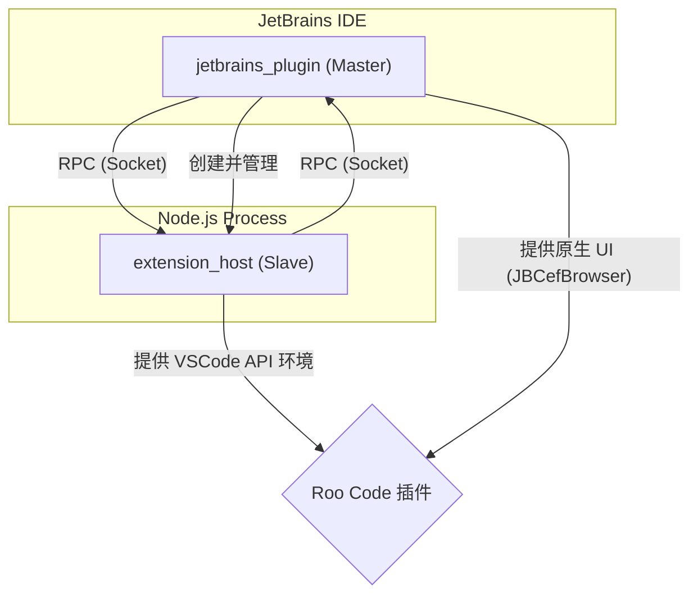

# Roo Code for JetBrains 开发者手册

## 📌 文档信息

| 项目 | 描述 |
|------|------|
| 产品名称 | Roo Code for JetBrains |
| 版本号 | v3.51.1 |
| 文档版本 | v1.1 |
| 最后更新 | 2026-03-16 |
| 适用用户 | 二次开发者、插件贡献者 |

---

## 📖 引言

### 目的与范围

本手册旨在为 Roo Code for JetBrains 项目的二次开发者 and 贡献者提供一份分层式、渐进式的技术指南。无论您是希望快速上手、进行日常功能开发，还是深入探索项目底层原理，都能在这里找到清晰的路径。

### 如何使用本文档

我们建议您根据自己的需求，从不同的部分开始阅读：

- **新贡献者**: 请从 **[第一部分：快速上手指南](#1-快速上手指南-quick-start)** 开始，目标是在 15 分钟内成功运行项目。
- **功能开发者**: 请重点阅读 **[第二部分：核心开发指南](#2-核心开发指南-the-core-guide)**，它将为您提供日常开发的标准流程和最佳实践。
- **架构师/资深开发者**: **[第三部分：深入主题](#3-深入主题-advanced-topics)** 提供了关于构建、调试和关键子系统的高级参考。

---

## 🚀 1. 快速上手指南 (Quick Start)

### 1.1 环境要求

在开始之前，请确保您的开发环境中已安装以下核心工具：

| 工具 | 版本要求 | 安装说明 |
|------|----------|----------|
| **Git** | 最新版 | 用于代码版本控制。 |
| **JDK** | 17+ | JetBrains 插件开发所必需的 Java 开发工具包。 |
| **Node.js** | 18.0.0+ | `extension_host` 的运行时环境。 |
| **IntelliJ IDEA**| 2023.1+ | 用于开发和调试 `jetbrains_plugin`。社区版或旗舰版均可。|

### 1.2 一键式初始化

项目提供了一键式的安装脚本，可以帮助您完成所有必要的环境初始化工作。

1. **Fork 并克隆仓库**

    ```bash
    # 首先，在 GitHub 上 Fork 本项目
    git clone https://github.com/YOUR_USERNAME/Roo-Code-JetBrains.git
    cd Roo-Code-JetBrains
    ```

2. **运行初始化脚本**

    ```bash
    # 该脚本会自动初始化 Git 子模块并安装所有 npm 依赖
    ./scripts/setup.sh
    ```

> **重要提示**: 在执行任何构建操作之前，请务必确保您已经成功执行了 `./scripts/setup.sh` 脚本。如果跳过此步骤，后续步骤将因缺少依赖而失败。

### 1.3 运行与验证

1. **在 IntelliJ IDEA 中打开项目**
    - 使用 IntelliJ IDEA 打开您刚刚克隆的项目根目录 (`Roo-Code-JetBrains`)。
    - IDEA 会自动识别并加载 `jetbrains_plugin` 目录下的 Gradle 项目。

2. **运行插件**
    - 在 Gradle 面板中，找到 `jetbrains_plugin` -> `Tasks` -> `intellij` -> `runIde`。
    - 双击 `runIde` 任务，Gradle 将会自动编译插件代码，并启动一个新的、搭载了本插件的 IntelliJ IDEA 实例供您调试。

### 1.4 “Hello World”：验证你的环境

为了确保一切都已正确设置，让我们来进行一个简单的代码修改，并观察其效果。

1. **打开核心启动文件**
    在 IntelliJ IDEA 中，找到并打开 `jetbrains_plugin/src/main/kotlin/com/roocode/jetbrains/plugin/WecoderPlugin.kt`。

2. **添加日志**
    找到 `runActivity` 方法，并在方法开头添加一行日志打印：

    ```kotlin
    override fun runActivity(project: Project) {
        println("====== Hello from Roo Code for JetBrains! Plugin is running. ======") // <-- 添加此行
        // ... a rest of the method
    }
    ```

3. **重新运行 `runIde`**
    再次运行 `runIde` Gradle 任务。

4. **查看日志**
    当新的 IDEA 沙箱实例启动后，回到你原来的主 IDEA 窗口，查看下方的 **Run** 面板。你应该能看到我们刚刚添加的 "Hello from Roo Code for JetBrains!" 日志输出。

---

## 🛠️ 2. 核心开发指南 (The Core Guide)

### 2.1 核心架构速览

Roo Code for JetBrains 的架构精髓在于**“模拟与适配”**。您可以将整个系统理解为一个“翻译官”，它让 JetBrains IDE 和 VSCode 插件两个原本不兼容的生态能够顺畅交流。



- **主从进程 (Master-Slave)**
  - **`jetbrains_plugin` (Master)**: 作为 IntelliJ 插件运行，是“主控”，负责创建 UI 窗口、管理 `extension_host` 进程等所有与 IDE 强相关的“重活”。
  - **`extension_host` (Slave)**: 作为一个独立的 Node.js 进程，是 VSCode 插件的“温室”，为其提供一个高度仿真的 VSCode API 环境。

- **RPC 双向通信**
  - 两个进程通过复用 VSCode 原生的 `IRPCProtocol` 机制进行通信，让 Kotlin 和 TypeScript 可以像调用本地函数一样互相调用。
  - 所有通信的“契约”都由 Kotlin 接口 (`*Shape.kt`) 定义。

- **混合 UI 模式**
  - 插件的工具窗口等“外壳”由 `jetbrains_plugin` 使用 IntelliJ 原生组件创建。
  - 窗口内的核心交互界面是一个 Web 应用，由 Roo Code 插件提供，并运行在嵌入式浏览器（`JBCefBrowser`）中。

### 2.2 项目结构导览

了解项目的核心目录结构，有助于您快速定位代码：

```
.
├── docs/                # 项目文档，包括本手册和架构设计
├── extension_host/      # Extension Host (Node.js) 模块
│   ├── src/             # TypeScript 源码
│   ├── package.json     # Node.js 依赖与脚本
│   └── vscode/          # VSCode 源码子模块
├── jetbrains_plugin/    # IntelliJ 插件 (Kotlin) 模块
│   ├── src/             # Kotlin 源码
│   └── build.gradle.kts # Gradle 构建脚本
└── scripts/             # 项目构建与维护脚本
```

| 目录 | 主要职责 |
|------|----------|
| `docs/` | 存放所有项目文档，包括您正在阅读的开发者手册和 `ARC.md` 架构文档。 |
| `extension_host/` | **VSCode 插件的“沙箱”**。负责提供 VSCode API 的模拟实现，并加载和运行 Roo Code 等插件。 |
| `jetbrains_plugin/` | **IntelliJ IDEA 插件本体**。负责与 IntelliJ IDEA 进行深度集成，并作为“主进程”管理 `extension_host`。 |
| `scripts/` | **自动化脚本**。提供了一系列用于环境初始化、构建、测试的 Shell 和 PowerShell 脚本。 |

### 2.3 通用开发流程 (Step-by-Step)

在 Roo Code for JetBrains 中新增一个端到端的功能，通常遵循以下标准流程。我们将以“从 IDE 获取信息并展示在 Roo Code UI 上”为例：

1. **步骤一：定义通信契约 (RPC Interface)**
    - **操作**: 在 `jetbrains_plugin` 的 `actors` 目录下，找到或创建一个合适的 `*Shape.kt` 接口文件，用于定义 `MainThread` 服务。
    - **原理**: 这是定义 RPC 的**服务端接口**。`extension_host` 将通过这个契约，以客户端的身份调用 `jetbrains_plugin` 的能力。

2. **步骤二：实现主进程能力 (MainThread Impl)**
    - **操作**: 在 `jetbrains_plugin` 中，创建一个新的 Kotlin 类，实现上一步定义的接口，并编写与 IntelliJ 平台交互的逻辑。
    - **原理**: 这是 RPC 的**服务端实现**。你需要在 `RPCManager.kt` 中通过 `rpcProtocol.set()` 将这个实现类的实例注册到对应的服务 ID 上，以便 RPC 框架在收到请求时能找到它。

3. **步骤三：实现扩展主机端 (ExtHost Impl)**
    - **操作**: 在 `extension_host` 中，创建一个对应的 `ExtHost...` 服务文件。在这个文件中，通过 `rpcProtocol.getProxy(MainContext.XXX)` 获取指向 `jetbrains_plugin` 中服务的动态代理。
    - **原理**: 这是 RPC 的**客户端调用**。`getProxy` 返回一个代理对象，调用它的方法就会发起一次跨进程的 RPC 请求。

4. **步骤四：暴露 API 给 VSCode 插件**
    - `extension_host` 的核心职责是模拟 `vscode` API。因此，你需要将 `ExtHostProblemProvider` 的功能，通过 `vscode.api` 命名空间暴露给 Roo Code 插件。
    - 例如，你可以创建一个 `vscode.problems.getWorkspaceProblems()` 方法，其内部调用 `ExtHostProblemProvider` 的方法。

5. **步骤五：在 Roo Code 中使用**
    - 现在，Roo Code 插件的开发者就可以像调用任何标准 VSCode API 一样，调用 `vscode.problems.getWorkspaceProblems()`，获取到来自 IntelliJ 的数据。

### 2.4 实战案例：实现 `copySelection` 命令

本章节将以 `workbench.action.terminal.copySelection` 命令的实现为例，严格遵循上述“通用开发流程”，深入剖析一个“命令驱动”的功能是如何实现的。

#### 2.4.1 功能定位

当 Roo Code 插件需要获取当前终端选中的文本时，它会执行一个 VSCode 命令 `workbench.action.terminal.copySelection`。`jetbrains_plugin` 插件会拦截这个命令，从当前激活的 IntelliJ Terminal 窗口中获取选中的文本，并将其写入剪贴板。

#### 2.4.2 代码溯源：命令注册与执行流程

1. **命令注册 (`EditorCommands.kt`)**:
    - 在 `jetbrains_plugin/src/main/kotlin/com/roocode/jetbrains/editor/EditorCommands.kt` 中，定义了编辑器相关的命令。

2. **RPC 入口 (`executeCommand`)**:
    - 当 `ExtHost` 端调用 `vscode.commands.executeCommand('workbench.action.terminal.copySelection')` 时，RPC 请求会最终路由到 `MainThreadCommands` 的 `executeCommand` 方法，并执行相应命令。

---

## 🔬 3. 深入主题 (Advanced Topics)

### 3.1 高级环境配置

#### 3.1.1 独立运行 Extension Host (Node.js)

在某些场景下，您可能需要独立于 JetBrains 插件来运行 `extension_host` 进行调试。

1. **进入 `extension_host` 目录**

    ```bash
    cd extension_host
    ```

2. **安装依赖**

    ```bash
    npm install
    ```

3. **以开发模式启动**

    ```bash
    npm run dev
    ```

### 3.2 调试技巧大全

#### 3.2.1 调试 JetBrains Plugin (Kotlin)

1. **使用 `runIde` 任务**: 在 IntelliJ IDEA 中以 Debug 模式运行 `runIde` 任务。
2. **设置断点**: 在 `jetbrains_plugin` Kotlin 代码中设置断点。
3. **触发与调试**: 在沙箱 IDEA 实例中执行操作，触发断点。

#### 3.2.2 调试 Extension Host (Node.js)

1. **找到调试端口**: `extension_host` 的子进程通常在 9229 端口上监听调试器。
2. **配置 Node.js 调试器**: 创建 "Attach to Node.js/Chrome" 调试配置，端口 9229。
3. **启动与附加**: 启动 `runIde` 后，运行 "Attach to Node.js" 调试配置。

### 3.3 核心架构详解

#### 3.3.1 主从进程 (Master-Slave) 原理

- **`jetbrains_plugin` (Master)**: 运行在 IntelliJ 中的“主控”，负责 UI、文件 IO、进程管理。
- **`extension_host` (Slave)**: 独立的 Node.js 进程，为 VSCode 插件提供仿真环境。

#### 3.3.2 RPC 双向通信机制

- **`extension_host` → `jetbrains_plugin`**: 插件调用 IDE 能力。
- **`jetbrains_plugin` → `extension_host`**: IDE 事件通知插件。

### 3.4 构建系统详解

#### 3.4.1 三种核心构建模式 (`debugMode`)

本项目的 Gradle 构建由 `-PdebugMode` 参数控制：

- **开发模式 (`-PdebugMode=idea`)**
  - **用途**: 日常开发调试。
  - **工作原理**: 直接引用 `extension_host/dist/` 产物。
- **发布模式 (`-PdebugMode=release`)**
  - **用途**: 构建最终分发包。
  - **工作原理**: 依赖预构建的 `platform.zip`。
- **轻量模式 (`-PdebugMode=none`)**
  - **用途**: CI 和单元测试。
  - **工作原理**: 不依赖 `platform.zip`，仅拷贝核心资源。

#### 3.4.2 关键预构建任务：`genPlatform`

- **作用**: 生成包含预编译 Node.js 原生模块的 `platform.zip`。
- **执行**: `./gradlew genPlatform`。

#### 3.4.3 完整构建脚本 `scripts/build.sh`

- **作用**: 顶层脚本，协调所有构建步骤。
- **用法**: `./scripts/build.sh --mode release`。

### 3.5 常见问题 (FAQ)

- **Q: `runIde` 启动失败，提示缺少依赖？**
  - **A**: 确保已运行 `./scripts/setup.sh`。
- **Q: 修改了 TS 代码但未生效？**
  - **A**: 确保在 `extension_host` 下运行了 `npm run build`。
- **Q: 如何查看 RPC 日志？**
  - **A**: 检查 `RPCManager.kt` 中配置的日志输出位置。
