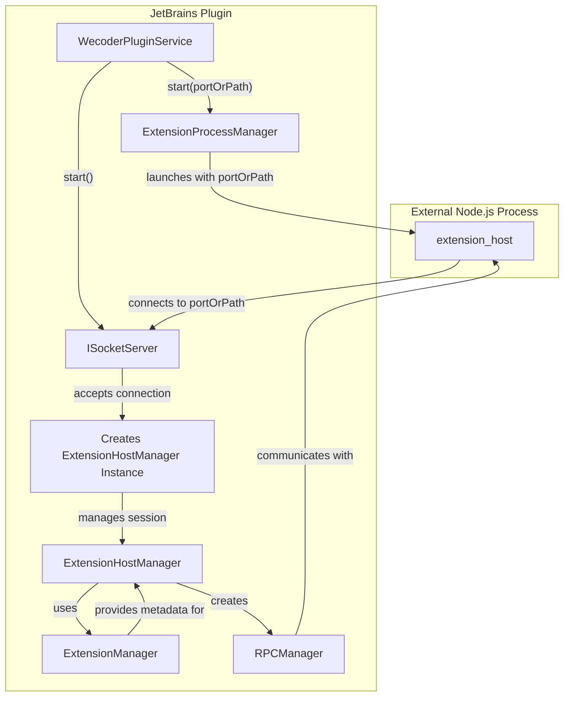
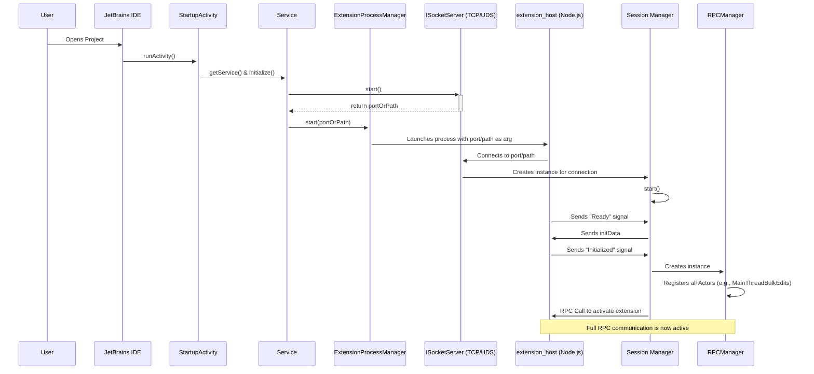

# Roo Code for JetBrains 插件内部进程通信架构

**目标读者**: 新加入项目的后端（Kotlin/Java）或前端（TypeScript/Node.js）开发者。

**文档目标**: 使读者能够快速理解 JetBrains 插件（主控端）如何启动、管理并与 VSCode 插件运行时（被控端 `extension_host`）进行通信的完整生命周期和核心组件交互。

---

## 1. 架构总览 (Architecture Overview)

### 1.1 核心理念：模拟与适配 (Simulation & Adaptation)

本项目的核心目标是在 JetBrains IDE 中运行为 VSCode API 构建的插件。为实现此目标，架构采用了“主从”模型：
*   **主控端 (Master)**: JetBrains 插件，运行在 JVM 中。它作为 RPC 服务端，负责管理子进程和响应 API 调用。
*   **被控端 (Slave)**: `extension_host` 进程，是一个标准的 Node.js 进程。它作为 RPC 客户端，加载并运行 VSCode 插件。

### 1.2 核心组件关系图



### 1.3 生命周期一览图 (Lifecycle at a Glance)



---

## 2. 启动与握手流程 (Initialization & Handshake)

#### 2.1 阶段一：插件预热 (Plugin Warm-up)
*   **触发点**: 用户打开一个项目 (`Project`)。
*   **核心类**: [`WecoderPlugin`](../../jetbrains_plugin/src/main/kotlin/com/roocode/jetbrains/plugin/WecoderPlugin.kt) (`StartupActivity`)
*   **关键动作**:
    1.  `runActivity` 被调用。
    2.  通过 `project.getService()` 获取 [`WecoderPluginService`](../../jetbrains_plugin/src/main/kotlin/com/roocode/jetbrains/plugin/WecoderPlugin.kt) 实例。
    3.  调用 `WecoderPluginService.initialize()`，正式开始初始化流程。

#### 2.2 阶段二：建立通信信道 (Establishing the Channel)
*   **核心类**: [`WecoderPluginService`](../../jetbrains_plugin/src/main/kotlin/com/roocode/jetbrains/plugin/WecoderPlugin.kt), `ISocketServer`, [`ExtensionProcessManager`](../../jetbrains_plugin/src/main/kotlin/com/roocode/jetbrains/core/ExtensionProcessManager.kt)
*   **关键动作**:
    1.  `WecoderPluginService` 根据操作系统选择 `ISocketServer` 的实现：Windows 使用 TCP (`ExtensionSocketServer`)，macOS/Linux 使用 UDS (`ExtensionUnixDomainSocketServer`)。
    2.  服务端启动并监听一个唯一的端口或 UDS 文件路径。
    3.  `WecoderPluginService` 获取到此 `portOrPath`。
    4.  `WecoderPluginService` 调用 `ExtensionProcessManager.start(portOrPath)`。
    5.  `ExtensionProcessManager` 启动 `extension_host` Node.js 进程，并将连接参数传递给它。
    6.  `extension_host` 进程启动后，发起连接。

#### 2.3 阶段三：会话建立与握手 (Session & Handshake)
*   **核心类**: `ISocketServer`, [`ExtensionHostManager`](../../jetbrains_plugin/src/main/kotlin/com/roocode/jetbrains/core/ExtensionHostManager.kt), [`extensionHostProcess.ts`](../../deps/vscode/src/vs/workbench/api/node/extensionHostProcess.ts)
*   **关键动作**:
    1.  `ISocketServer` 接受 (`accept`) `extension_host` 的连接。
    2.  为该连接创建一个**新的 `ExtensionHostManager` 实例**来处理会话。
    3.  **`ExtHost` -> `MainThread` 握手**:
        *   `extensionHostProcess.ts` 发送 `Ready` 信号。
        *   `ExtensionHostManager` 收到后，构造 `initData` (包含插件元数据、IDE 环境信息等) 并发送。
        *   `extensionHostProcess.ts` 收到并处理完 `initData` 后，发送 `Initialized` 信号。

#### 2.4 阶段四：RPC 激活 (RPC Activation)
*   **核心类**: [`ExtensionHostManager`](../../jetbrains_plugin/src/main/kotlin/com/roocode/jetbrains/core/ExtensionHostManager.kt), [`RPCManager`](../../jetbrains_plugin/src/main/kotlin/com/roocode/jetbrains/core/RPCManager.kt) (Kotlin), [`ExtensionManager`](../../extension_host/src/extensionManager.ts)
*   **关键动作**:
    1.  `ExtensionHostManager` 收到 `Initialized` 信号。
    2.  创建 `RPCManager` (Kotlin) 实例，它会注册所有 `MainThread...` Actor，建立完整的双向 RPC 通道。
    3.  调用 `ExtensionManager.activateExtension`，通过 RPC 通知 `extension_host` 执行插件的 `activate` 函数。
    4.  至此，整个系统就绪。

---

## 3. 核心组件职责详解 (Component Deep Dive)

*   **`WecoderPluginService`**: 项目级总控制器，负责统筹启动和销毁流程。
*   **`ExtensionProcessManager`**: 外部进程的“保姆”，只负责 `extension_host` 的启停和监控。
*   **`ISocketServer`**: 网络连接的“监听者”接口，负责接受连接并分发给会话处理器。
*   **`ExtensionHostManager`**: 连接会话的“处理器”，负责与单个 `extension_host` 实例的完整握手和生命周期管理。
*   **`ExtensionManager` (Kotlin)**: VSCode 插件的“注册表”，负责解析 `package.json` 并触发激活流程。
*   **`RPCManager` (Kotlin)**: 双向通信的“翻译官”，负责注册所有 Actor (服务实现) 并建立 RPC 协议。

### 3.5 `extension_host` 内部启动与桥接机制

`extension_host` 进程内部的启动和桥接机制是整个架构的精髓所在，它确保了 VSCode 核心库能在我们的环境中正确运行。

*   **`extension.ts` ([`extension_host/src/extension.ts`](../../extension_host/src/extension.ts)) 的双重角色**:
    *   **生产模式**: 当 `ExtensionProcessManager` 启动它时，它负责调用 `start()` 函数，将执行权立即交给 VSCode 核心库。
    *   **调试模式**: 当由 `main.ts` 启动时，它会激活其“IPC 桥接器”的角色，通过**猴子补丁 (Monkey Patching)** 重写 `process.on` 和 `process.send`，将 VSCode 核心库的 IPC 通信重定向到 TCP Socket 上。

*   **`extensionHostProcess.ts` ([`deps/vscode/src/vs/workbench/api/node/extensionHostProcess.ts`](../../deps/vscode/src/vs/workbench/api/node/extensionHostProcess.ts)) 的连接与握手**:
    *   这是 VSCode `ExtHost` 的真正入口。它通过读取连接参数来决定连接方式。
    *   在生产模式下，它会主动连接到 `jetbrains_plugin` 开启的 `portOrPath`。
    *   连接建立后，它会与 `ExtensionHostManager` 进行“`Ready` -> `InitData` -> `Initialized`”的二次握手。

---

## 4. 示例工作流：应用一次文件修改

本节以“AI 修改代码”为例，端到端地追踪一次操作的完整流程。

### 4.1 核心概念：Actor 与 Proxy

*   **Actor (执行者)**: **真正实现功能**的 Kotlin 类，运行在 JetBrains 插件中，可直接调用 IntelliJ API。例如 `MainThreadBulkEdits`。
*   **Proxy (代理)**: 在 `extension_host` 中运行的 **TypeScript 对象**。它与 Actor 有着相同的方法签名，但其内部实现是**将调用序列化并通过网络发送给对应的 Actor**。

### 4.2 时序图：一次文件修改的旅程

```mermaid
sequenceDiagram
    participant ExtHost as extension_host (TS)
    participant RPCProxy as MainThreadBulkEdits Proxy (TS)
    participant RPCManager as RPCManager (Kotlin)
    participant Actor as MainThreadBulkEdits (Kotlin)
    participant EditorMgr as EditorAndDocManager (Kotlin)
    participant IntelliJEditor as IntelliJ Document API

    ExtHost->>RPCProxy: 1. vscode.workspace.applyEdit(edit)
    RPCProxy->>+RPCManager: 2. RPC Call: $tryApplyWorkspaceEdit(serializedEdit)
    RPCManager->>+Actor: 3. Routes to Actor instance
    Actor->>+EditorMgr: 4. getEditorHandleByUri(...)
    EditorMgr-->>-Actor: 5. Returns EditorHolder
    Actor->>Actor: 6. handle.applyEdit(textEdit)
    Note right of Actor: Inside applyEdit, it calls IntelliJ API
    Actor->>+IntelliJEditor: 7. WriteCommandAction.run(...)
    IntelliJEditor-->>-Actor: 8. File modified
    Actor-->>-RPCManager: 9. Returns true
    RPCManager-->>-RPCProxy: 10. RPC Response: Promise resolves with true
    RPCProxy-->>-ExtHost: 11. applyEdit Promise resolves
```

### 4.3 详细步骤分解

1.  **`extension_host` (TS 端)**:
    *   Roo Code 插件调用 `vscode.workspace.applyEdit(edit)`。
    *   `ExtHostWorkspace` 模块获取 `MainThreadBulkEdits` 的代理，并调用其 `$tryApplyWorkspaceEdit` 方法。

2.  **`ServiceProxyRegistry.kt` ([`jetbrains_plugin/.../core/ServiceProxyRegistry.kt`](../../jetbrains_plugin/src/main/kotlin/com/roocode/jetbrains/core/ServiceProxyRegistry.kt)) (服务标识符)**:
    *   负责将字符串形式的服务 ID (如 `"MainThreadBulkEdits"`) 与 Kotlin 的接口类型进行绑定。

3.  **`RPCManager.kt` ([`jetbrains_plugin/.../core/RPCManager.kt`](../../jetbrains_plugin/src/main/kotlin/com/roocode/jetbrains/core/RPCManager.kt)) (服务注册)**:
    *   在初始化时，将服务 ID 注册到一个具体的 Actor 实例上。

4.  **`MainThreadBulkEdits.kt` (Actor)**:
    *   `tryApplyWorkspaceEdit` 方法被调用，解析数据并委托给 `EditorAndDocManager`。

5.  **`EditorHolder.kt` (最终执行者)**:
    *   将 VSCode 格式的编辑操作转换为 IntelliJ 的 `Document` 操作。

---

## 5. 多项目场景 (Multi-Project Scenario)

*   **隔离模型**: 插件遵循 IntelliJ 的项目级服务模型。
*   **资源实例化**: 当打开多个项目时，`WecoderPluginService` 等都会为每个项目**创建一套独立的实例**。
*   **交互图**: 每个项目都拥有自己独立的 `extension_host` 进程和通信信道，互不干扰。

---

## 6. IPC 适配开发与调试范式

### 6.1 IPC 适配开发工作流

1.  **第一步：研究 VSCode 契约**: 在 `deps/vscode/src/` 目录下找到接口定义。
2.  **第二步：定义 Kotlin 适配接口**: 在 `jetbrains_plugin/src/main/kotlin/com/roocode/jetbrains/actors/` 目录下创建 Shape 接口。
3.  **第三步：实现 `MainThread` 适配逻辑**: 在 `jetbrains_plugin` 中实现该接口。
4.  **第四步：实现 `ExtHost` 调用逻辑**: 在 Kotlin 中通过代理调用 TS 端功能。
5.  **第五步：端到端验证**: 运行 `./gradlew runIde` 进行测试。

### 6.2 关键参考路径

*   **VSCode 契约定义源头**: `deps/vscode/src/vs/workbench/api/common/extHost.protocol.ts`
*   **IPC 编程规范**: `docs/ARC/IPC_Contracts_zh.md`
*   **Kotlin `MainThread` 服务实现**: `jetbrains_plugin/src/main/kotlin/com/roocode/jetbrains/actors/`
*   **RPC 协议核心实现**: `jetbrains_plugin/src/main/kotlin/com/roocode/jetbrains/core/RPCProtocol.kt`
